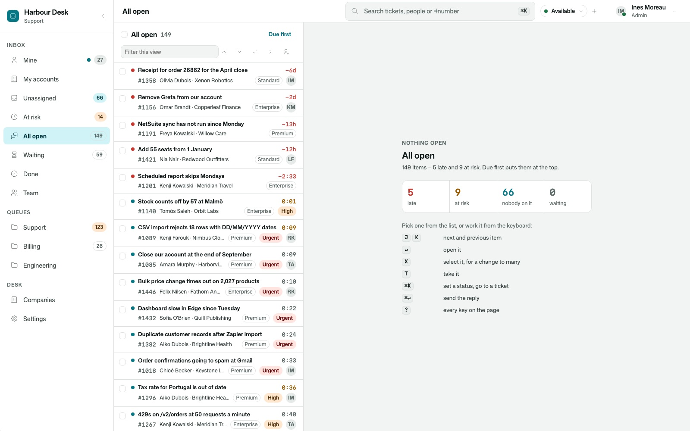
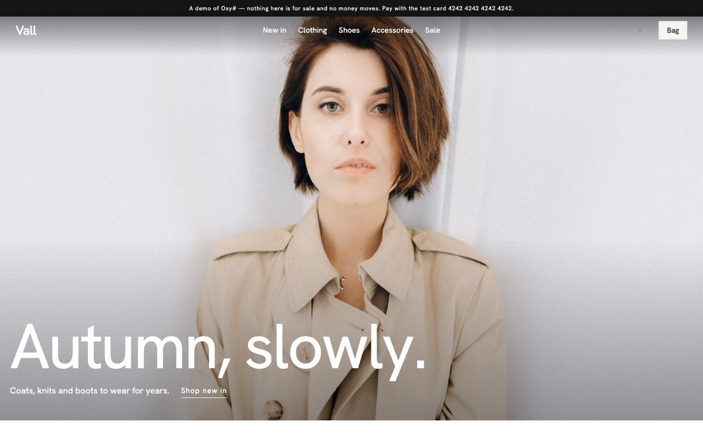
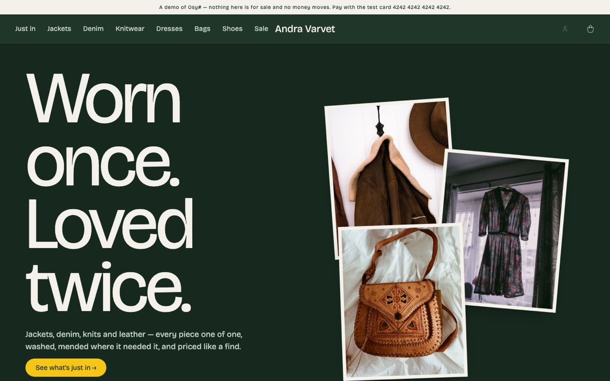

# Osy# templates

Complete, working apps to start from. Each one is a real project — pages, data, photographs and tests — built on
published Osy# packages, so what you get compiles and runs on day one, and every line of it is yours to change.

```console
osy init --template helpdesk      # a support desk — asks for its name, its languages and its model provider
osy init shop --style fashion     # a new project from the Vall fashion store, in its five looks
osy launch                        # build it and open it in your browser
```

Every template is downloaded from a release here and checked against the SHA-256 the release states before a file
is written; the new project's `osyrin.lock` records which release and which hash it started from.

## Helpdesk

A support desk a team leaving Zendesk or Help Scout would recognise: every ticket is one conversation, whichever way
the customer wrote; queues, assignment and promises kept in business hours; a help centre and its knowledge base;
reports; and the whole desk in English, Swedish and Arabic. `osy init --template helpdesk` asks for the app's name,
which languages it speaks (leave Swedish or Arabic out, or add your own), and which model translates messages and
searches by meaning — Anthropic, OpenAI, Gemini, or none.

| style | | |
|---|---|---|
| **harbour** — Harbour, rail | A support desk: tickets as conversations, queues and promises, a help centre, reports — in English, Swedish and Arabic. |  |

## Shops

Every shop here runs on [`Osysharp.Shop`](https://github.com/osysharp/shop) — catalogue, accounts, bag, orders, card
and Klarna payments, receipts, returns, mail and a staff desk — so the styles differ only in what a customer sees.

| style | | |
|---|---|---|
| **fashion** — Vall, five looks | A fashion label in five looks — Atelier, Boutique, Drop, Index and Studio — picked per version of the site. |  |
| **thrift** — Second Round, five looks | A second-hand shop in five looks — the Rail, the Kiosk, the Fitting room, the Swap sheet and Loud — picked per version of the site. |  |
| **workshop** — Rust & Chrome, storefront | A workshop selling restored vintage bicycles — each one unique, with its spec sheet. |  |

## After `osy init`

1. `osy launch` builds the shop into your local platform and opens it.
2. `osy user add you@example.com --role Staff`, then `osy import --as you@example.com` loads the sample catalogue.
   Sign in and open `/staff/desk` to manage it.
3. Make it yours: the theme in `model/theme.osy`, the pages in `model/pages/`, the words everywhere. Replace the
   catalogue in `data/` with your own products, or add them in the desk.
4. Switch payments on when you are ready: `osy secret set StripeApiKey`, and Klarna's market in the desk.

`model/demo.osy` carries the "this is a demo" banner and the test-card hint; delete what you do not want.

## Licence

The code is MIT. The photographs are credited in each template's `CREDITS.md` under their own licences (Pexels and
Unsplash) — replace them with your own before you sell anything.
