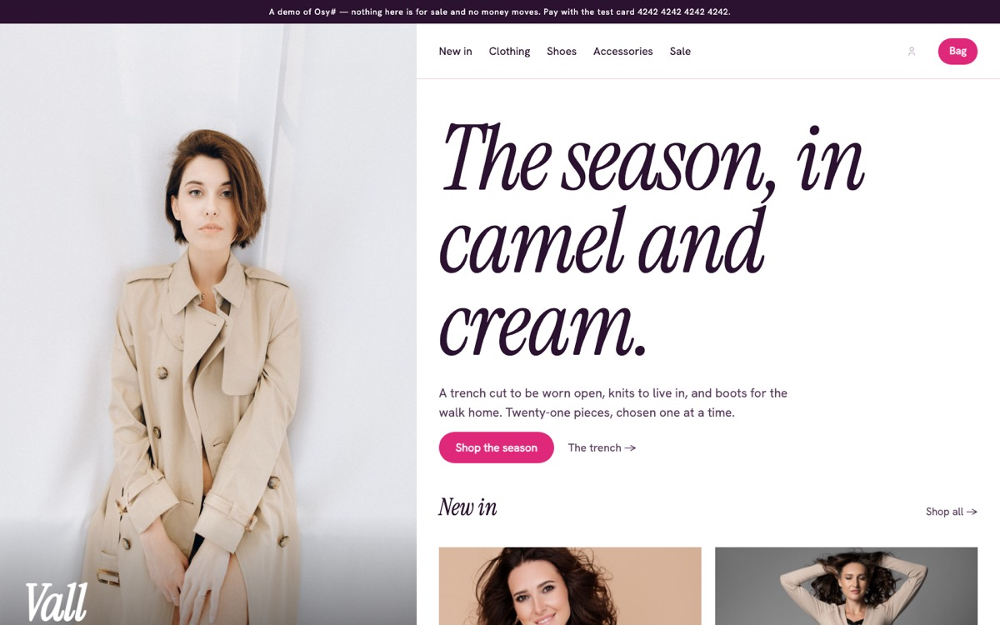
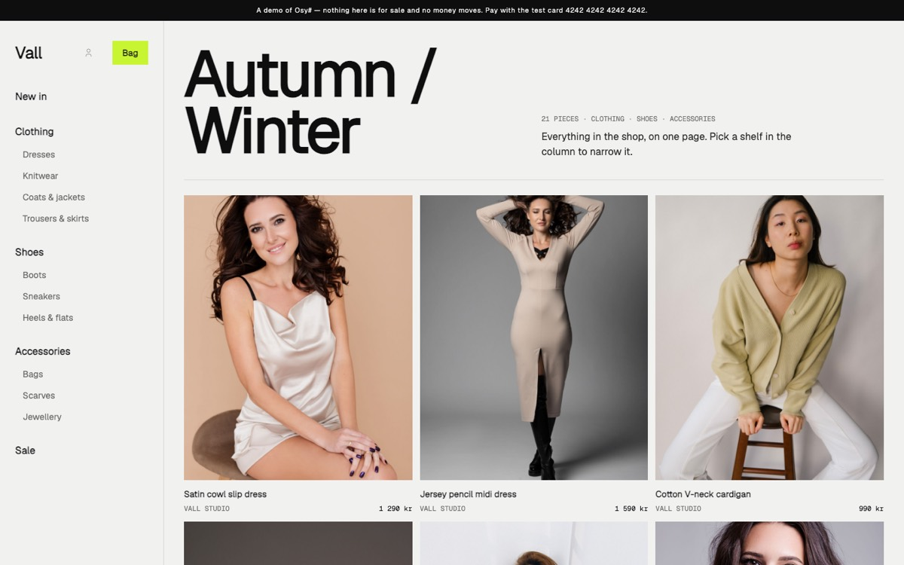
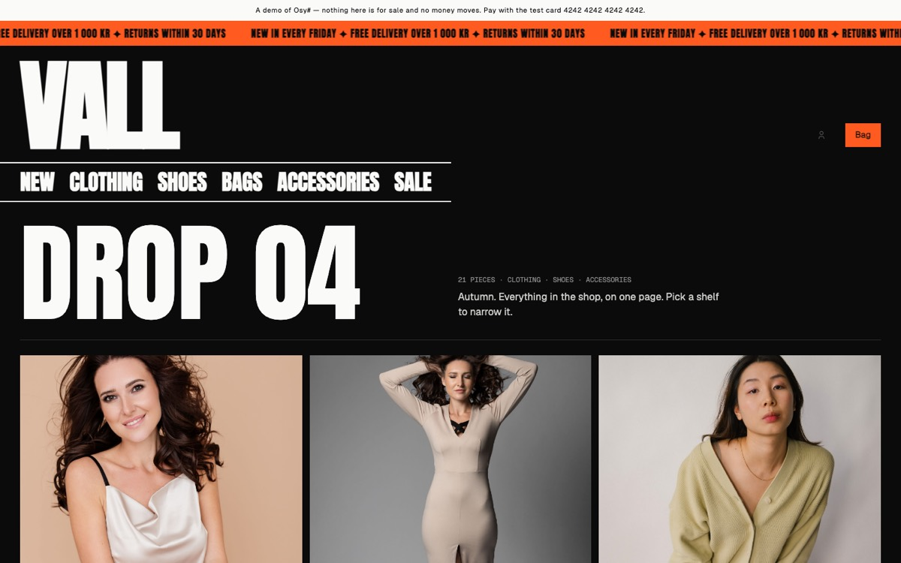
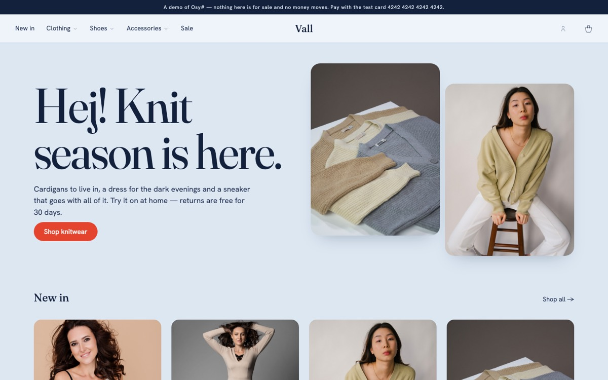
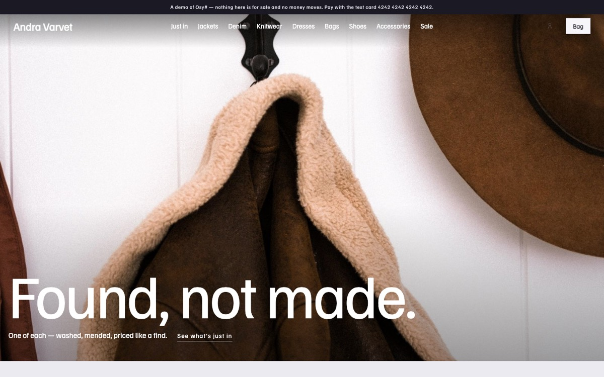
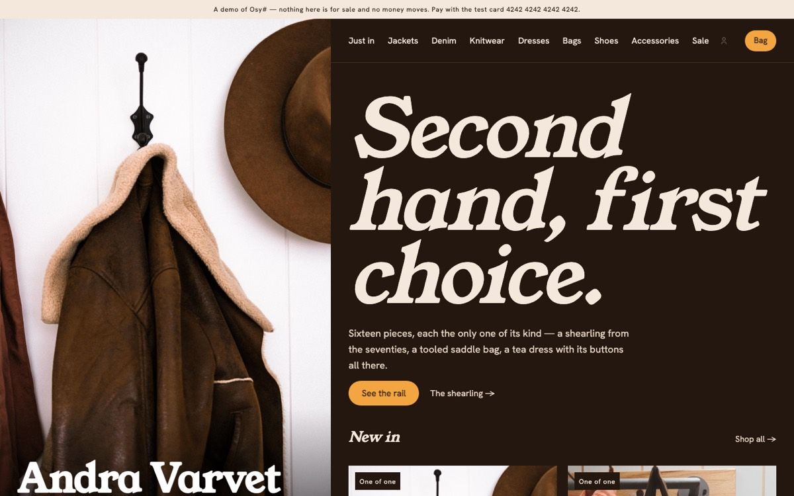
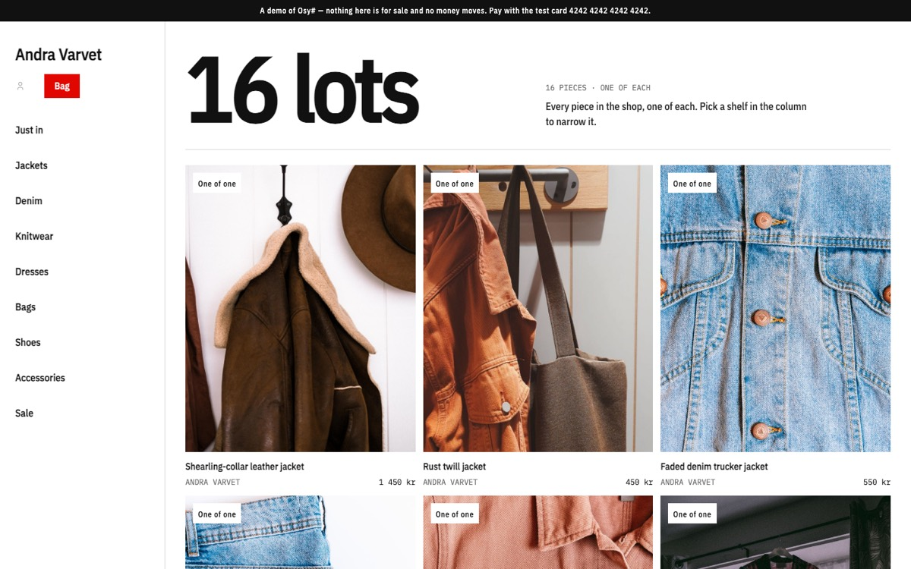
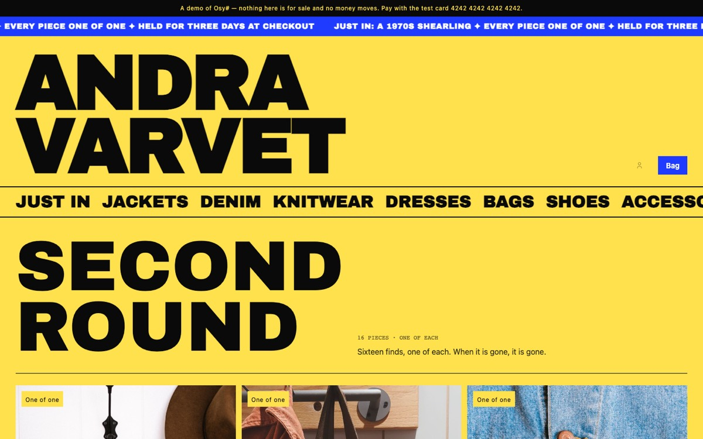

# Osy# templates

Complete, working apps to start from. Each one is a real project — pages, data, photographs and tests — built on
published Osy# packages, so what you get compiles and runs on day one, and every line of it is yours to change.

```console
osy init shop --style atelier     # a new project from the Atelier shop
osy launch                        # build it and open it in your browser
```

## Shops

Every shop here runs on [`Osysharp.Shop`](https://github.com/osysharp/shop) — catalogue, accounts, bag, orders, card
and Klarna payments, receipts, returns, mail and a staff desk — so the styles differ only in what a customer sees.

| style | | |
|---|---|---|
| **atelier** — Vall, editorial | A fashion label in a quiet editorial layout — large photographs, a thin header, room to breathe. |  |
| **studio** — Vall, split | A fashion label with a split layout — the picture on one side, the words on the other. |  |
| **index** — Vall, catalogue | A fashion label as a dense catalogue — many products at a glance, sorted and filtered. |  |
| **drop** — Vall, marquee | A fashion label for drops — a loud marquee, dark pages, sold in US dollars. |  |
| **boutique** — Vall, storefront | A fashion boutique with a classic storefront — a hero, featured pieces, the shop's story. |  |
| **rail** — Andra Varvet, storefront | A second-hand shop where every piece is one of one, shown like a rail in the shop. |  |
| **kiosk** — Andra Varvet, editorial | A second-hand shop as a zine — hand-picked finds with their stories. |  |
| **fitting** — Andra Varvet, split | A second-hand shop laid out like a fitting room — one piece at a time, up close. |  |
| **swap** — Andra Varvet, catalogue | A second-hand shop as a swap sheet — everything in one long list with its measurements. |  |
| **loud** — Andra Varvet, marquee | A second-hand shop with bright colour and big type, sold in US dollars. |  |
| **workshop** — Rust & Chrome, storefront | A workshop selling restored vintage bicycles — each one unique, with its spec sheet. |  |

## After `osy init`

1. `osy launch` builds the shop into your local platform and opens it.
2. `osy user add you@example.com --role Staff`, then `osy import --as you@example.com` loads the sample catalogue.
   Sign in and open `/staff/desk` to manage it.
3. Make it yours: the theme in `model/theme.osy`, the pages in `model/pages/`, the words everywhere. Replace the
   catalogue in `data/` with your own products, or add them in the desk.
4. Switch payments on when you are ready: `osy secret set StripeApiKey`, and Klarna's market in the desk.

`model/demo.osy` carries the "this is a demo" banner and the test-card hint; delete what you do not want.

## Licence

The code is MIT. The photographs are credited in each template's `CREDITS.md` under their own licences (Pexels and
Unsplash) — replace them with your own before you sell anything.
